# Documentation for Linux Practice Projects

## Commands for File Manipulation

1. The command `sudo apt upgrade`: short for superuser do, sudo is one of the most popular Linux commands that lets you perform tasks that require administrative or root permissions.

2. The command `pwd`: to find path of your current/present working directory.

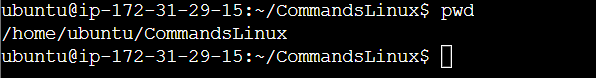

pwd [option]

3. The command `cd`: to navigate through Linux files and directories.

4. The command `ls`: lists files and directories within a system

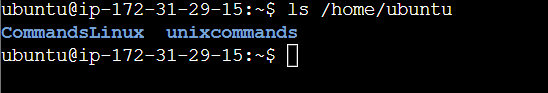

ls [option]

5. The command `cat`: concatenate, or cat, combines, and writes file content to the standard output.

6. The command `cp`: to copy files or directories and their content.

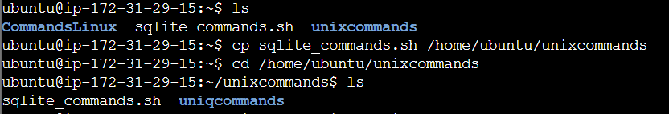

7. The command `mv`: used to move and rename files and directories.

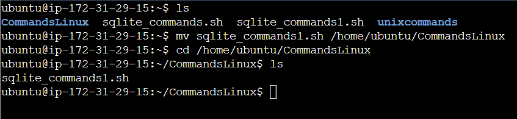

mv (to rename file)

.png>)

8. The command `mkdir`: use to create one or multiple directories at once and set permissions for each of them.

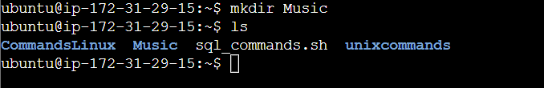

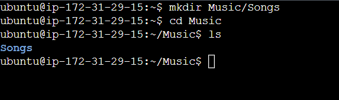

9. The command `rmdir`: to permanently delete an empty directory

10. The command `rm`: used to delete files within a directory

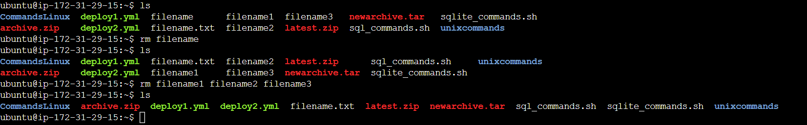

11. The command `touch`: allows to create an empty file.

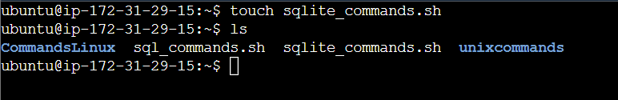

12. The command `locate`: used to find a file in the database

13. The command `find`: used to search for files within a specific directory and perform subsequent operations.

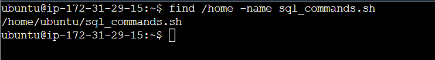

14. The command `grep`: lets you find a word by searching through all the texts in a specific file.

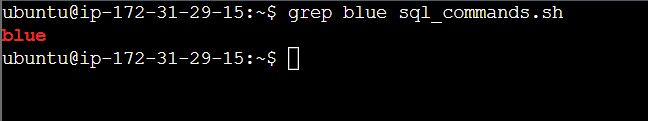

15. The command `df`: used to report the system's disk space usage.

16. The command `du`: used to check how much space a file or directory takes up.

17. The command `head`: allows to view the first ten lines of a text.

18. The command `tail`: displays the last ten lines of a file.

19. The command `diff`: compares two contents of a file line by line.

20. The command `tar`: archives multiple files into a TAR file.

## Commands for File Permissions and Ownership

21. The command `chmod`: modifies a file or directory's read, write and execute permissions.

22. The command `chown`: lets you change the ownership of a file, directory, or symbolic link to a specified username.

23. The command `jobs`: displays all the running processes along with their statuses.

24. The command `kill`: terminates an unresponsive program manually.

25. The command `ping`: used for checking whether a network or a server is reachable.

26. The command `wget`: used to download files from the internet

27. The command `uname`: uname or unix name command is used to print detailed information about the Linux system and hardware.

28. The command `top`: used to display all the running processes and a dynamic real-time view of the current system.

29. The command `history`: used to display 500 previously executed commands.

30. The command `man`: provides a user manual or any commands or utilities a user can run in terminal, including the name, description, and options.

31. The command `echo`: built-in utility that displays a line of text or string using the standard output.

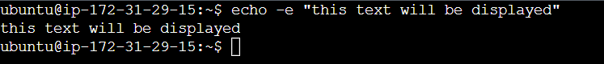

32. The command `zip` and `unzip`: zip command is used to compress a file and unzip command etxracts the zipped files from an archive.

33. The command `hostname [option]` : used to know the system's hostname

34. The command `useradd` and `userdel`: useradd command is used to create a new account and userdel is used to delete a user account.

35. The command `apt-get`: used for handling Advanced Package Tool(APT) libraries in Linux.

36. The command `nano` and `vi`: comes with the operating system which allows user to edit and manage files via a text editor.

`nano`

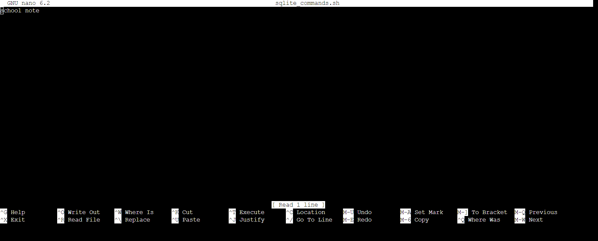

`vi`

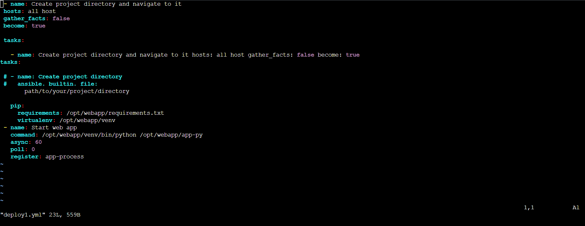

37. The command `alias` & `unalias`: alias command allows you to create a shortcut with the same functionality as a command, filename, or text and unalias command deletes an existing alias.

38. The command `su`: used to switch user.

39. The command `htop [options]`: an interactive program that monitors system resources and server process in real time.

40. The command `ps`: it produces a snapshot of all the running processes in your system.

