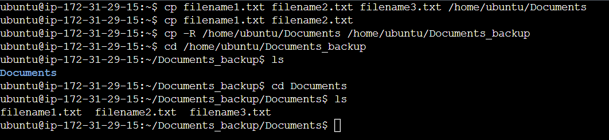

# Linux Project for commands

## Commonds for File Manipulation

1. Running the command `sudo apt upgrade`

2. the command `pwd`

3. the command `cd`

4. the command `ls`

5. the command `cat`

6. the command `cp`

7. the command `mv`

.png>)

8. the command `mkdir`

9. the command `rmdir`

10. the command `rm`

11. the command `touch`

12. the command `locate`

13. the command `find`

14. the command `grep`

15. the command `df`

16. the command `du`

17. the command `head`

18. the command `tail`

19. the command `diff`

20. the command `tar`

## Commands for File Permissions and Ownership

21. the command `chmod`

22. the command `chown`

23. the command `jobs`

24. the command `kill`

25. the command `ping`

26. the command `wget`

27. the command `uname`

28. the command `top`

29. the command `history`

30. the command `man`

31. the command `echo`

32. the command `zip` and `unzip`

33. the command `hostname`

34. the command `useradd` and `userdel`

35. the command `apt-get`

36. the command `nano` and `vi`

`vi`

37. the command `alias` & `unalias`

38. the command `su`

39. the command `htop`

40. the command `ps`

