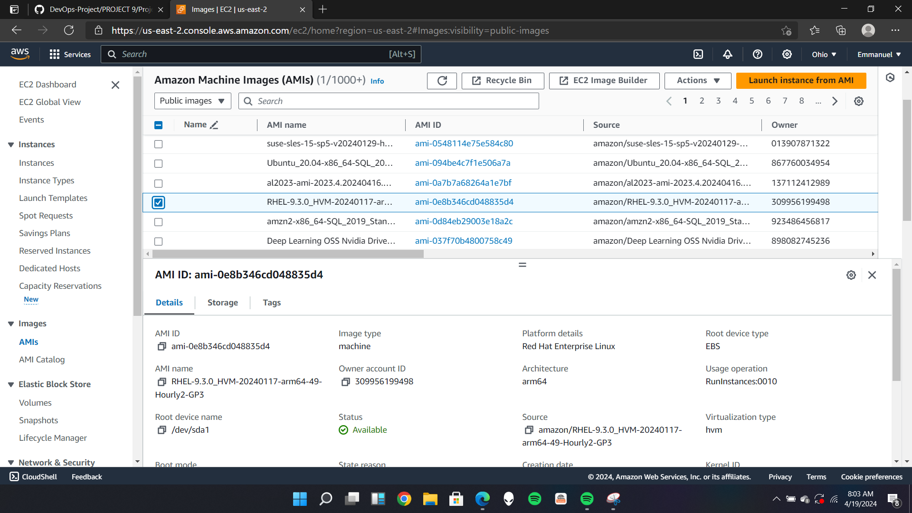
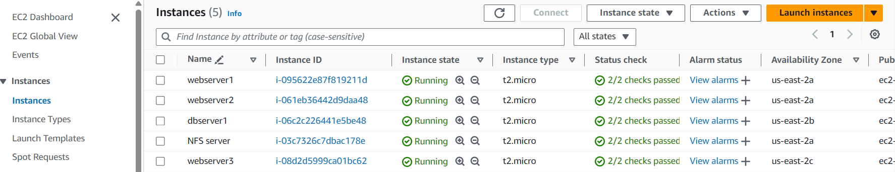

# DEVOPS TOOLING WEBSITE SOLUTION

In this project,a solution that consists of the following components will be implemented:

- Infrastructure: AWS
- Webserver Linux: Red Hat Enterprise Linux 8
- Database Server: Ubuntu 20.04 + MySQL
- Storage Server: Red Hat Enterprise Linux 8 + NFS Server
- Programming Language: PHP
- Code Repository: Github

For Rhel 8 server use this ami RHEL-9.3.0_HVM-20240117-arm64-49-Hourly2-GP3 (ami-0e8b346cd048835d4)



On the diagram below you can see a pattern where several stateless Web Servers share a common database and also access the same files using **Network File System(NFS)** as a shared file storage. Even though the NFS server might be located on a compeletly separete hardware - for Web Servers it look like a local file system from where they can serve the same files.


# Implementing a business website using NFS for the backend file storge

Step 1 - Prepare NFS Server

1. Spin up a new EC2 instance with RHEL Linux 8 Operating System



2. Based on LVM experience from Project 9, Configure LVM on the Server.

- create volumes for the NFS server


- view the attached volume on server


- using the gdisk utility to create partitions


- use `lsblk` utility to view the newly configured partition on each of the 3 disks.


- Once partition is created install lvm2 using `sudo yum install lvm2` then carry out the other process as in project 9.


- Use `pvcreate` utility to mark each of 3 disks as physical volumes (PVs) to be used by LVM.

 to be used by LVM.png>)

- Verify that the Physical volume has been created sucessfullly by runnning `sudo pvs`


- Use `vgcreate` utility to add all 3 PVs to a volume group (VG). Name the VG webdata-vg using the command:


- Verify that the VG has been created successfully by running `sudo vgs`


- Instead of formating the disks as `ext4` you will have to format them as `xfs`

`````
sudo mkfs -t xfs /dev/webdata-vg/lv-apps
sudo mkfs -t xfs /dev/webdata-vg/lv-logs
sudo mkfs -t xfs /dev/webdata-vg/lv-opt
`````


- Ensure there are 3 Logical Volumes. lv-opt lv-apps, and lv-logs

3. Create mount points on /mnt directory for the logical volumes as follow:

Mount lv-apps on /mnt/apps – To be used by webservers

Mount lv-logs on /mnt/logs – To be used by webserver logs

Mount lv-opt on /mnt/opt – To be used by Jenkins server in Project 11

````
sudo mkdir /mnt/apps

sudo mkdir /mnt/logs

sudo mkdir /mnt/opt

sudo mount /dev/webdata-vg/lv-apps /mnt/apps

sudo mount /dev/webdata-vg/lv-logs /mnt/logs

sudo mount /dev/webdata-vg/lv-opt /mnt/opt
````


- Once mount is completed run `sudo blkid` to get the UUID of the mount part, open and paste the UUID in the fstab file.


`sudo vi /etc/fstab`


`````
sudo mount -a 
sudo systemctl daemon-reload
`````
4. Install NFS server, configure it to start on reboot and make sure it is up and running

```
sudo yum -y update
sudo yum install nfs-utils -y
sudo systemctl start nfs-server.service
sudo systemctl enable nfs-server.service
sudo systemctl status nfs-server.service
```


5. Export the mounts for webservers’ subnet cidr to connect as clients. For simplicity, you will install your all three Web Servers inside the same subnet, but in production set up you would probably want to separate each tier inside its own subnet for higher level of security. To check your subnet cidr – open your EC2 details in AWS web console and locate ‘Networking’ tab and open a Subnet link:


- Make sure we set up permission that will allow our Web servers to read, write and execute files on NFS:

````
sudo chown -R nobody: /mnt/apps

sudo chown -R nobody: /mnt/logs

sudo chown -R nobody: /mnt/opt

sudo chmod -R 777 /mnt/apps

sudo chmod -R 777 /mnt/logs

sudo chmod -R 777 /mnt/opt

sudo systemctl restart nfs-server.service
````


- Configure access to NFS for clients within the same subnet (example of Subnet CIDR – 172.31.32.0/20):

````
sudo vi /etc/exports

/mnt/apps <Subnet-CIDR>(rw,sync,no_all_squash,no_root_squash)
/mnt/logs <Subnet-CIDR>(rw,sync,no_all_squash,no_root_squash)
/mnt/opt <Subnet-CIDR>(rw,sync,no_all_squash,no_root_squash)

Esc + :wq!  to exit vim

sudo exportfs -arv
````


6. Check which port is used by NFS and open it using Security Groups (add new Inbound Rule) 

`rpcinfo -p | grep nfs`


Important note: In order for NFS server to be accessible from your client, you must also open following ports: TCP 111, UDP 111, UDP 2049


# Configure backend database as part of 3 tier architecture

Step 2 - 

1. Install MySQL server

`sudo apt install mysql-server`


2. Create a database and name it `tooling`

````
sudo mysql
create database tooling;
````


3. Create a database user and name it `webaccess`

create user 'webaccess'@'172.31.16.0/20' identified by 'password';

4. Grant permission to webaccess user on tooling database to do anything only from the webservers subnet cidr


Step 3 -

During the next steps we will do following:

- Configure NFS client (this step must be done on all three servers)

- Deploy a Tooling application to our Web Servers into a shared NFS folder

- Configure the Web Servers to work with a single MySQL database

1. Launch a new EC2 instance with RHEL 8 Operating System


2. Install NFS client

`sudo yum install nfs-utils nfs4-acl-tools -y`


3. Mount /var/www/ and target the NFS server’s export for apps

`````
sudo mkdir /var/www
sudo mount -t nfs -o rw,nosuid <NFS-Server-Private-IP-Address>:/mnt/apps /var/www
`````


4. Verify that NFS was mounted successfully by running df -h. Make sure that the changes will persist on Web Server after reboot:

````
sudo vi /etc/fstab

add following line;

<NFS-Server-Private-IP-Address>:/mnt/apps /var/www nfs defaults 0 0
````


Make sure that the changes will persist on Web Server after reboot:


5. Install Remi’s repository, Apache and PHP

```
sudo yum install httpd -y

sudo yum install https://dl.fedoraproject.org/pub/epel/epel-release-latest-8.noarch.rpm

sudo yum install dnf-utils http://rpms.remirepo.net/enterprise/remi-release-8.rpm

sudo yum module  list php -y

sudo yum module reset php -y

sudo yum module enable php:remi-7.4 -y

sudo yum install php php-opcache php-gd php-curl php-mysqlnd -y

sudo systemctl start php-fpm

sudo systemctl enable php-fpm

sudo setsebool -P httpd_execmem 1

sudo systemctl restart httpd
```


# Repeat steps 1-5 for another 2 Web Servers.

6. Verify that Apache files and directories are available on the Web Server in `/var/www` and also on the NFS server in `/mnt/apps`. If you see the same files – it means NFS is mounted correctly. You can try to create a new file touch `test.txt` from one server and check if the same file is accessible from other Web Servers.

7. Locate the log folder for Apache on the Web Server and mount it to NFS server’s export for logs. Repeat step 4 under the 'prepare web servers' to make sure the mount point will persist after reboot.


`sudo vi /etc/fstab`


Make sure that the changes will persist on Web Server after reboot:


8. Fork the tooling source code from Darey.io Github Account to your Github account.


9. Deploy the tooling website’s code to the Webserver. Ensure that the html folder from the repository is deployed to `/var/www/html`


Note 1: Do not forget to open TCP port 80 on the Web Server.

Note 2: If you encounter 403 Error – check permissions to your `/var/www/html` folder and also disable SELinux `sudo setenforce 0`

To make this change permanent – open following config file `sudo vi /etc/sysconfig/selinux` and set `SELINUX=disabled` then restart httpd.

```
sudo systemctl restart httpd
sudo systemctl status httpd
```


10. Update the website’s configuration to connect to the database (in `/var/www/html/functions.php` file). Apply `tooling-db.sql` script to your database using this command `mysql -h -u -p < tooling-db.sql`


- Install MySQL on the web servers using `sudo yum install mysql -y` then cd into the tooling directory to connect to thhe database.


If you can't connect to it and there is an error simply move to the DB server to edit the inbound security group.


Then edit the mysqld.cnf file on Database server 

```
sudo vi /etc/mysql/mysql.conf.d/mysqld.cnf

sudo systemctl restart mysql

sudo systemctl status mysql
```


11. Create in MySQL a new admin user with username: myuser and password: password:
INSERT INTO ‘users’ (‘id’, ‘username’, ‘password’, ’email’, ‘user_type’, ‘status’) VALUES -> (2, ‘myuser’, ‘5f4dcc3b5aa765d61d8327deb882cf99’, ‘user@mail.com’, ‘admin’, ‘1’);


12. Open the website in your browser `http://<Web-Server-Public-IP-Address-or-Public-DNS-Name>/index.php` and make sure you can login into the websute with `myuser` user.


