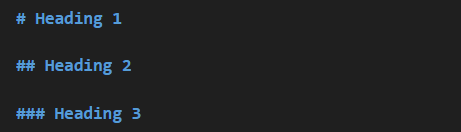
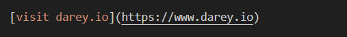
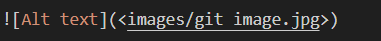
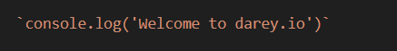

# Documentation for Git Project

## **Initializing a Repository and Making Commits**

### Initializing a Git Repository

- Open a terminal on computer,eg git bash,
- create working folder or directory; `mkdir Devops`
- change or move into working folder; `cd Devops`
- run `git init`

### Making Commit

- Create a file `touch index.txt`
- Write a sentence inside the text file and save
- Add your changes to git staging area using the command `git add .`
- To commit changes to git, run the command `git commit -m "initail commit"`

## **Working with Branches**

1. Making a new git branch with the command `git checkout -b`

- -b flags helps create and change into the the new branch

2. Listing the git branches using the command `git branch`

3. Change into an Old Branch with command `git checkout <branch-name>`

4. Merging a Branch into another Branch with command `git merge`

5. Deleting a git branch with command ` git branch -d <branch_name>`

## **Collaboration and Remote Repositories**

1. Create a github account

2. Creating a new Repository

3. Pushing Local Git Repository to Remote Github Repository

- Add a remote repository to the local repository using command `git remote add origin <link to your github repo>`

- After committing changes in local repo. Push the content to the remote repo using the command `git push origin <branch name>`

4. Cloning Remote Git Repository with command `git clone <link to your remote repository>`

## **Branch Management and Tagging**

### Introduction to Markdown Syntax

1. Headings: To create heading

# Heading 1

## Heading 2

### Heading 3

2. Emphasis: asterisks or underscore is used to Emphasis text

_italic_ or _italic_

**bold** or **bold**

3. Lists: markdown has support for both ordered and unorded list

   ordered list example:

- Item 1
- Item 2
- Item 3

unordered list example:

1. First item
2. Second item
3. Third item

4. Links: To create hyperlink

   [visit darey.io](https://www.darey.io)

5. Images: To display an image

6. Code: To display or code snippets

   `console.log('Welcome to darey.io')`

